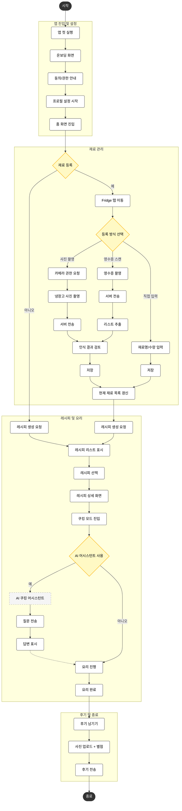

# 사용자 흐름도 (User Flows)

## 전체 프로세스

```mermaid
flowchart TD
    %% 스타일 정의
    classDef startend fill:#333,stroke:#333,stroke-width:2px,color:white,rx:10,ry:10;
    classDef proc fill:#fff,stroke:#333,stroke-width:1px,color:black,rx:4,ry:4;
    classDef decision fill:#fff9c4,stroke:#fbc02d,stroke-width:2px,color:black,rx:4,ry:4;
    classDef subproc fill:#f5f5f5,stroke:#999,stroke-width:1px,color:black,stroke-dasharray: 5 5;

    %% 노드 정의
    Start([시작]):::startend
    Finish([종료]):::startend
    
    %% 1. 온보딩 프로세스
    subgraph Onboarding [앱 진입 및 설정]
        direction TB
        A[앱 첫 실행]:::proc --> B[온보딩 화면]:::proc
        B --> C[동의/권한 안내]:::proc
        C --> D[프로필 설정 시작]:::proc
        D --> E[홈 화면 진입]:::proc
    end

    %% 메인 분기점
    E --> F{재료 등록}:::decision

    %% 2. 재료 관리 프로세스
    subgraph Fridge [재료 관리]
        direction TB
        F -- 예 --> G[Fridge 탭 이동]:::proc
        G --> I{등록 방식 선택}:::decision
        
        %% 카메라 등록
        I -- 사진 촬영 --> J[카메라 권한 요청]:::proc
        J --> K[냉장고 사진 촬영]:::proc
        K --> L[서버 전송]:::proc
        L --> M[인식 결과 검토]:::proc
        
        %% 영수증 등록
        I -- 영수증 스캔 --> O[영수증 촬영]:::proc
        O --> P[서버 전송]:::proc
        P --> Q[리스트 추출]:::proc
        Q --> M
        
        %% 직접 입력
        I -- 직접 입력 --> R[재료명/수량 입력]:::proc
        R --> S[저장]:::proc
        
        M --> N[저장]:::proc
        N --> T[현재 재료 목록 갱신]:::proc
        S --> T
    end

    %% 3. 요리 및 AI 프로세스
    subgraph Cooking [레시피 및 요리]
        direction TB
        F -- 아니오 --> H[레시피 생성 요청]:::proc
        T --> U[레시피 생성 요청]:::proc
        
        H --> V[레시피 리스트 표시]:::proc
        U --> V
        
        V --> W[레시피 선택]:::proc
        W --> X[레시피 상세 화면]:::proc
        X --> Y[쿠킹 모드 진입]:::proc
        
        Y --> Z{AI 어시스턴트 사용}:::decision
        
        %% AI 루프
        Z -- 예 --> AA[AI 쿠킹 어시스턴트]:::subproc
        AA --> AB[질문 전송]:::proc
        AB --> AC[답변 표시]:::proc
        AC -.-> AD
        
        Z -- 아니오 --> AD[요리 진행]:::proc
        AD --> AE[요리 완료]:::proc
    end

    %% 4. 후기 프로세스
    subgraph Review [후기 및 종료]
        AE --> AF[후기 남기기]:::proc
        AF --> AG[사진 업로드 + 별점]:::proc
        AG --> AH[후기 전송]:::proc
    end

    Start --> A
    AH --> Finish
```
